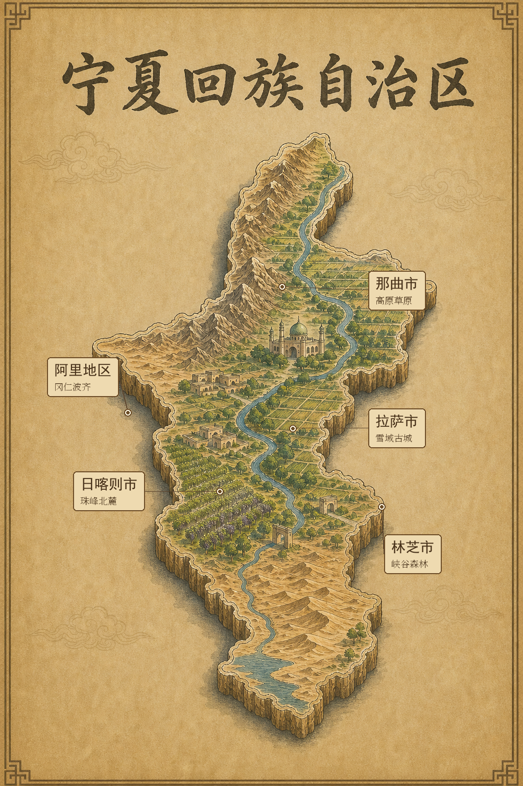
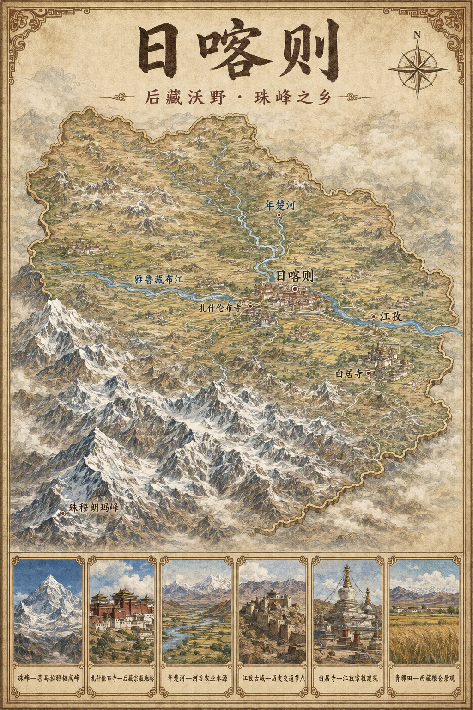
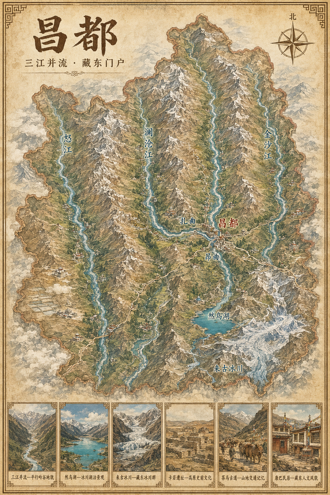
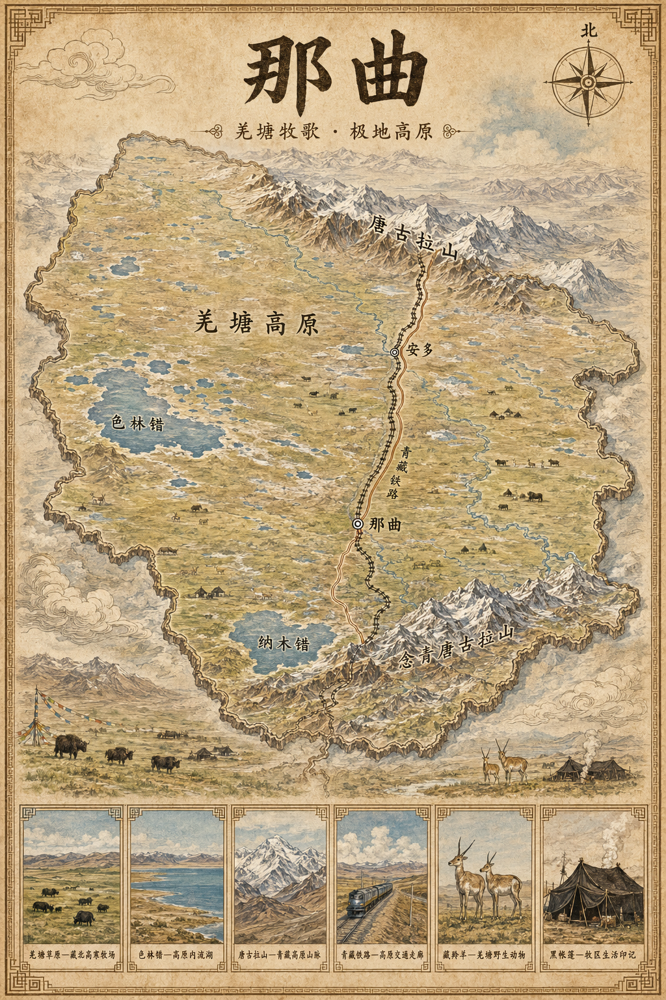

# 中国地理调查

中国地理调查：省份手绘地理图与文旅地图资料项目。

## 内容分类

| 分类 | 内容 |
| --- | --- |
| `全国省份手绘地图/` | 按省级行政区归档的总览图、地级行政区分图与发布文案 |
| `provinces/` | 内蒙古、河北、河南等早期成套手绘地图 |
| `copywriting/` | 小红书发布配文 |
| `docs/` | 省份手绘地理图生成与整理流程 |

## 西藏自治区手绘地图

点击任意缩略图可查看 PNG 原图。主图统一存放在
[`全国省份手绘地图/西藏自治区/images`](全国省份手绘地图/西藏自治区/images)；
[`西藏手绘地图海报_9张`](全国省份手绘地图/西藏自治区/西藏手绘地图海报_9张)
是便于整套浏览与转发的镜像归档，因此不重复展示缩略图。

### 省级总览

<table>
  <tr>
    <td align="center">
      <a href="全国省份手绘地图/西藏自治区/images/01-西藏自治区总图.png">
        
         西藏自治区总图
      </a>
    </td>
    <td align="center">
      <a href="全国省份手绘地图/西藏自治区/images/01-西藏自治区总图-未标注备份.png">
        
         总图·未标注备份
      </a>
    </td>
    <td align="center">
      <a href="全国省份手绘地图/西藏自治区/images/01_西藏自治区_初版.png">
        
         西藏自治区·初版
      </a>
    </td>
    <td align="center">
      <a href="全国省份手绘地图/西藏自治区/images/02_西藏自治区_标签修正版.png">
        
         西藏自治区·标签修正版
      </a>
    </td>
  </tr>
</table>

### 地级市

<table>
  <tr>
    <td align="center">
      <a href="全国省份手绘地图/西藏自治区/images/03_拉萨市.png">
        
         拉萨市
      </a>
    </td>
    <td align="center">
      <a href="全国省份手绘地图/西藏自治区/images/04_日喀则市.png">
        
         日喀则市
      </a>
    </td>
    <td align="center">
      <a href="全国省份手绘地图/西藏自治区/images/05_昌都市.png">
        
         昌都市
      </a>
    </td>
  </tr>
  <tr>
    <td align="center">
      <a href="全国省份手绘地图/西藏自治区/images/06_林芝市.png">
        
         林芝市
      </a>
    </td>
    <td align="center">
      <a href="全国省份手绘地图/西藏自治区/images/07_山南市.png">
        
         山南市
      </a>
    </td>
    <td align="center">
      <a href="全国省份手绘地图/西藏自治区/images/08_那曲市.png">
        
         那曲市
      </a>
    </td>
  </tr>
</table>

### 地区

<table>
  <tr>
    <td align="center">
      <a href="全国省份手绘地图/西藏自治区/images/09_阿里地区.png">
        
         阿里地区
      </a>
    </td>
  </tr>
</table>

## 说明

本仓库上传的是可直接浏览的 PNG 成品与文案资料。部分 ZIP 压缩包使用 Git
LFS 管理；README 画廊优先引用可直接在 GitHub 中打开的 PNG 原图。
